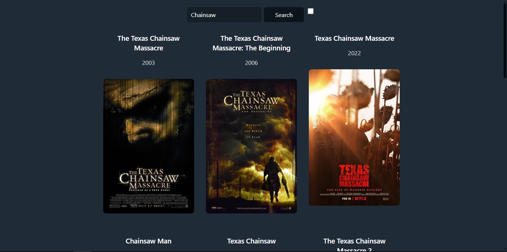

# React Movie search

Application built with React for searching movies using the OMDb API, WaterCSS, and custom hooks.

The goal of this project was to practice the concepts of custom hooks for code optimization.

## Disclaimer

This project is a practice exercise following a tutorial by [Midudev](https://www.youtube.com/watch?v=GOEiMwDJ3lc&t=6920s). All credit for the foundational concepts and techniques goes to them. Please refer to their channel for more detailed explanations and additional resources.
